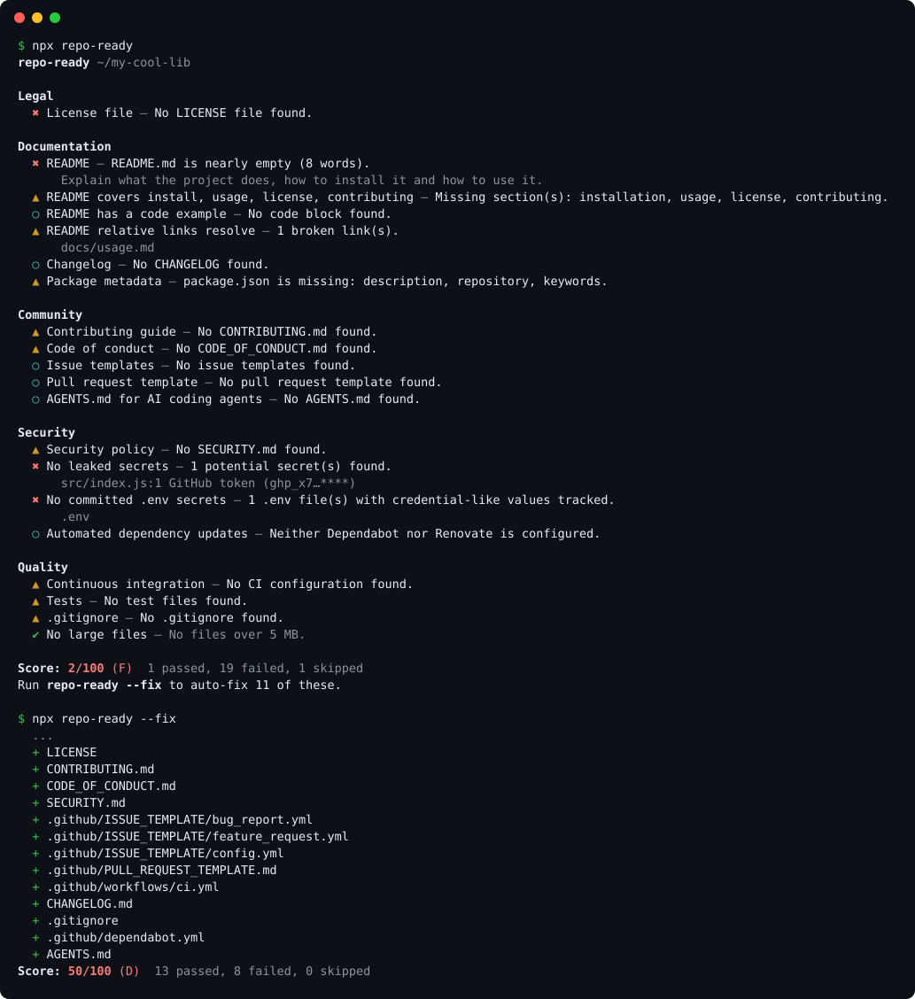

<div align="center">

# repo-ready

**Is your repository ready for open source? Find out in one command, and fix what's missing.**

[](https://github.com/macodev00/Idk-letting-opus-decide/actions/workflows/ci.yml)
[](https://github.com/macodev00/Idk-letting-opus-decide)
[](LICENSE)


</div>

`repo-ready` audits a repository for everything people expect from a healthy open-source project: a valid license, a useful README, contributing and security policies, issue templates, CI, tests, and **no leaked secrets**. It gives you a score out of 100, then `--fix` generates the missing files, tailored to your project's language and tooling.

- **One command, zero config, zero dependencies.** Runs anywhere Node 18+ runs.
- **Fixes, not just complaints.** Creates LICENSE (10 licenses), CONTRIBUTING, CODE_OF_CONDUCT, SECURITY, issue/PR templates, CI workflow, Dependabot, .gitignore, CHANGELOG and AGENTS.md. It never overwrites a file you already have.
- **Catches the embarrassing stuff.** Leaked API keys (GitHub, AWS, OpenAI, Anthropic, Stripe, Slack, Google, npm, PyPI, …), committed `.env` files, broken README links, a license that disagrees with your `package.json`.
- **Language-aware.** Node (npm, pnpm, yarn, bun), Python, Go, Rust, Java, Ruby, PHP and .NET.
- **Built for CI.** GitHub Action with job summaries, annotations and SARIF for code scanning; `--min-score` to gate pull requests.

<p align="center"></p>

## Installation

No install needed:

```sh
npx github:macodev00/Idk-letting-opus-decide
```

Or install it globally:

```sh
npm install -g github:macodev00/Idk-letting-opus-decide
repo-ready
```

## Usage

```sh
repo-ready                    # audit the current directory
repo-ready path/to/repo       # audit another directory
repo-ready --fix              # generate missing files
repo-ready --fix --dry-run    # preview what --fix would create
repo-ready --fix --license Apache-2.0 --contact security@example.com
repo-ready --min-score 80     # exit 1 if the score is below 80
repo-ready --format markdown  # report for a PR comment or job summary
repo-ready --badge            # print a score badge for your README
```

| Option | Description |
| --- | --- |
| `--fix` | Create missing files. Existing files are never touched. |
| `--dry-run` | With `--fix`, list what would be created without writing anything. |
| `--license <id>` | License for `--fix`: `MIT` (default, or whatever `package.json` declares), `Apache-2.0`, `ISC`, `BSD-2-Clause`, `BSD-3-Clause`, `MPL-2.0`, `GPL-3.0`, `LGPL-3.0`, `AGPL-3.0`, `Unlicense`. |
| `--holder <name>` | Copyright holder. Defaults to the `package.json` author, then `git config user.name`. |
| `--contact <email>` | Contact address for SECURITY.md and CODE_OF_CONDUCT.md. On GitHub, SECURITY.md also links to private vulnerability reporting. |
| `--format <fmt>` | `text` (default), `json`, `markdown` or `sarif`. |
| `-o, --output <file>` | Write the report to a file. |
| `--min-score <n>` | Exit with code 1 if the score is below `n`. |
| `--strict` | Exit with code 1 if any error-level check fails. |
| `--only <ids>` / `--skip <ids>` | Run or skip specific checks (comma-separated). |
| `--list-checks` | List all checks. |
| `-v, --verbose` | Also show skipped checks and why each check matters. |

Exit codes: `0` success, `1` score below `--min-score` or `--strict` failure, `2` usage error.

## GitHub Action

Add a readiness report to every pull request:

```yaml
# .github/workflows/repo-ready.yml
name: repo-ready
on: [push, pull_request]
permissions:
  contents: read
jobs:
  repo-ready:
    runs-on: ubuntu-latest
    steps:
      - uses: actions/checkout@v7
      - uses: macodev00/Idk-letting-opus-decide@v1
        with:
          min-score: 80
```

The action writes a Markdown report to the job summary and annotates failures. Inputs: `path`, `min-score`, `strict`, `only`, `skip`, `fix`, `license`, `contact`, `summary`, `sarif-file`. Outputs: `score`, `grade`, `failed`, `fixed`, `badge-url`.

<details>
<summary>Show findings in the Security tab (SARIF)</summary>

```yaml
    permissions:
      contents: read
      security-events: write
    steps:
      - uses: actions/checkout@v7
      - uses: macodev00/Idk-letting-opus-decide@v1
        with:
          sarif-file: repo-ready.sarif
      - uses: github/codeql-action/upload-sarif@v4
        if: always()
        with:
          sarif_file: repo-ready.sarif
```
</details>

<details>
<summary>Open a pull request with the missing files</summary>

```yaml
name: repo-ready fix
on: workflow_dispatch
permissions:
  contents: write
  pull-requests: write
jobs:
  fix:
    runs-on: ubuntu-latest
    steps:
      - uses: actions/checkout@v7
      - uses: macodev00/Idk-letting-opus-decide@v1
        with:
          fix: true
          license: MIT
      - uses: peter-evans/create-pull-request@v8
        with:
          title: Add missing community files
          branch: repo-ready/fix
          commit-message: Add missing community files (repo-ready)
```
</details>

## Checks

| Check | Severity | What it looks for |
| --- | --- | --- |
| `license` | error | A LICENSE file. Recognizes MIT, Apache-2.0, GPL/LGPL/AGPL, BSD, MPL, ISC, Unlicense, 0BSD and more. |
| `license-consistency` | warning | `package.json`, `pyproject.toml`, `Cargo.toml` or `composer.json` declare the same license as LICENSE. |
| `readme` | error | A README with real content (50+ words). |
| `readme-sections` | warning | Sections for installation, usage, license and contributing. |
| `readme-example` | info | At least one code block. |
| `readme-links` | warning | Relative links and images in the README point to files that exist. |
| `contributing` | warning | CONTRIBUTING.md (root, `.github/` or `docs/`). |
| `code-of-conduct` | warning | CODE_OF_CONDUCT.md. |
| `security-policy` | warning | SECURITY.md. |
| `issue-templates` | info | GitHub issue templates or forms (GitLab templates count too). |
| `pr-template` | info | A pull request template. |
| `ci` | warning | GitHub Actions, GitLab CI, CircleCI, Travis, Azure Pipelines, Jenkins, Buildkite, Bitbucket, Drone or Woodpecker. |
| `tests` | warning | Test files in any common layout, including inline Rust tests. |
| `changelog` | info | CHANGELOG/HISTORY/NEWS, or automated release notes (changesets, release-please, semantic-release, git-cliff). |
| `gitignore` | warning | A .gitignore, and no committed `node_modules`, `__pycache__`, `.DS_Store`, etc. |
| `secrets` | error | 18 kinds of credentials in tracked files, with redacted previews. Private keys only count when real key material follows the PEM header. |
| `env-files` | error | No committed `.env` files containing credential-like values (`.env.example` is fine). |
| `large-files` | info | No files over 5 MB outside Git LFS. |
| `package-metadata` | warning | Description, repository, keywords and license in your package manifest. |
| `dependency-updates` | info | Dependabot or Renovate. |
| `agents-md` | info | AGENTS.md (or CLAUDE.md, `.cursor/rules`, Copilot instructions) so AI coding agents know how to build and test. |

The score is weighted by severity (error 10, warning 5, info 2); skipped checks don't count. **A** is 90+, **B** 80+, **C** 65+, **D** 50+.

In a git repository, only tracked and unignored files are checked, so your local `node_modules` or build output never affects the result.

## Configuration

Optional. Put a `.repo-ready.json` in the repository root, or a `"repo-ready"` key in `package.json`:

```json
{
  "skip": ["agents-md", "changelog"],
  "minScore": 80,
  "secrets": {
    "ignorePaths": ["^docs/examples/"],
    "includeTests": false
  }
}
```

The secret scanner skips test and fixture directories (`test/`, `tests/`, `__tests__/`, `spec/`, `fixtures/`, `testdata/`, …) by default, because test certificates and fake tokens live there. Set `"includeTests": true` to scan them too. It also ignores database URLs pointing at `localhost` or using default credentials like `postgres:postgres`. To silence a single false positive, add `repo-ready-ignore` in a comment on that line (`gitleaks:allow` and `pragma: allowlist secret` also work).

> **Note:** community files inherited from an organization's `.github` repository aren't visible in a clone, so `repo-ready` reports them as missing. Add those checks to `skip` if that's how your organization shares them.

## Programmatic API

```js
import { audit } from 'repo-ready';

const report = audit('path/to/repo', { fix: false, skip: ['agents-md'] });
console.log(report.score, report.grade);
for (const r of report.results.filter((r) => r.status === 'fail')) {
  console.log(`${r.id}: ${r.message}`);
}
```

## How is this different from…

- **GitHub's Community Standards page** shows a similar checklist, but only in the browser, only for GitHub, and it can't run in CI, scan for secrets or generate language-aware files.
- **[repolinter](https://github.com/todogroup/repolinter)** covered similar ground and is now archived. `repo-ready` needs no config file or dependencies and fixes what it finds.
- **[OpenSSF Scorecard](https://github.com/ossf/scorecard)** is excellent for supply-chain security (branch protection, pinned dependencies, signed releases) and needs the GitHub API. `repo-ready` focuses on what a new visitor or contributor sees, works offline, and runs on any git host. They complement each other.

## Contributing

Contributions are very welcome, especially new checks, secret patterns and templates for more ecosystems. See [CONTRIBUTING.md](CONTRIBUTING.md).

```sh
git clone https://github.com/macodev00/Idk-letting-opus-decide.git repo-ready
cd repo-ready
npm test
node bin/repo-ready.js .
```

## License

[MIT](LICENSE). License templates come from [choosealicense.com](https://github.com/github/choosealicense.com) (MIT).
